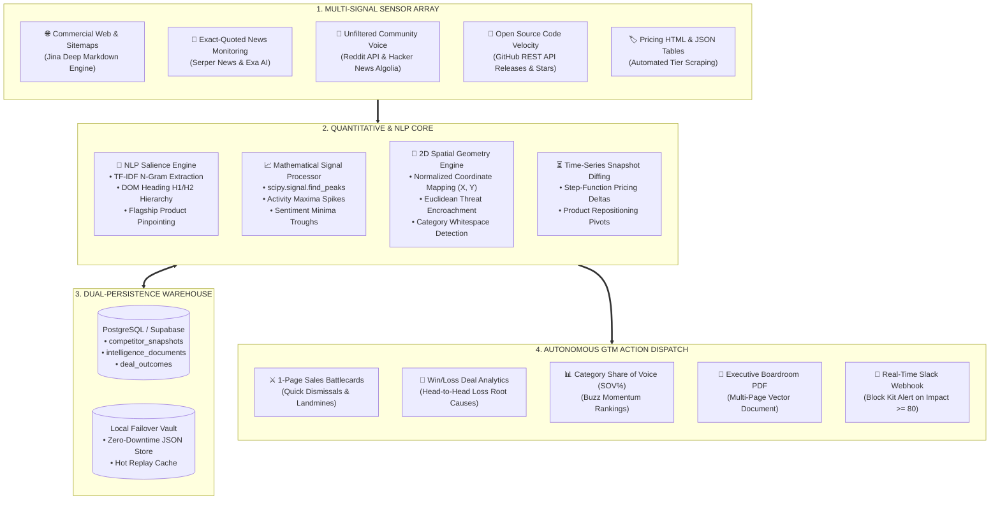
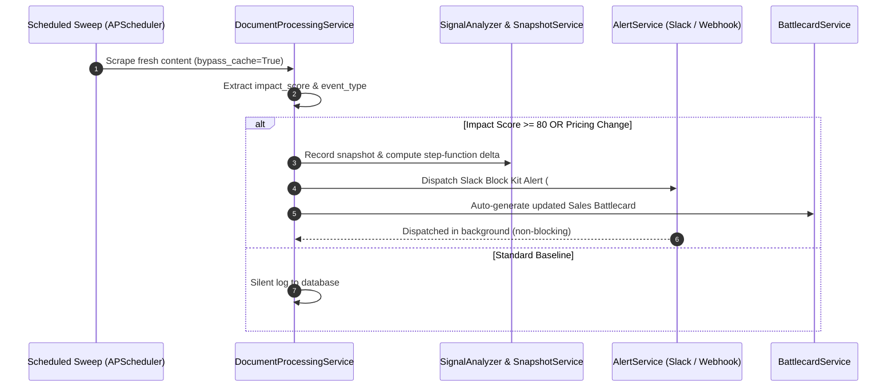

<div align="center">

#  AUTONOMOUS COMPETITIVE INTELLIGENCE ENGINE
### Multi-Signal Ingestion • Deterministic Signal Processing (Maxima/Minima) • NLP Salience • Spatial Positioning Radar • Autonomous GTM Weapons

[](https://fastapi.tiangolo.com)
[](https://python.org)
[](https://groq.com)
[](https://scipy.org)
[](https://supabase.com)
[](https://www.reportlab.com)
[](LICENSE)

<p align="center">
  <b>A real-time, quantitative competitive intelligence platform designed to replace $50,000/year legacy software (Klue, Crayon, Kompyte).</b><br>
  Continuous sensor grid monitoring across 15+ channels, mathematical inflection point detection (SciPy <code>find_peaks</code>), TF-IDF Flagship product extraction, Euclidean 2D threat encroachment mapping, and autonomous sales battlecards.
</p>

</div>

---

## System Index
- [Why Traditional Scrapers Fail](#-why-traditional-scrapers-fail)
- [Master System Architecture](#-master-system-architecture)
- [Mathematical & Signal Processing Core](#-mathematical--signal-processing-core)
  - [1. Inflection Maxima & Minima Detection](#1-inflection-maxima--minima-detection-scipy-find_peaks)
  - [2. NLP Flagship Product & TF-IDF N-Gram Salience](#2-nlp-flagship-product--tf-idf-n-gram-salience)
  - [3. 2D Spatial Positioning Radar & Threat Encroachment](#3-2d-spatial-positioning-radar--threat-encroachment)
  - [4. Category Boundary Benchmarks & Pricing Whitespace](#4-category-boundary-benchmarks--pricing-whitespace)
  - [5. Time-Series Historical Snapshots & Step-Function Deltas](#5-time-series-historical-snapshots--step-function-deltas)
- [The 12 Enterprise Intelligence Weapons (API Matrix)](#-the-12-enterprise-intelligence-weapons)
- [Autonomous Alerting & GTM Dispatch Loop](#-autonomous-alerting--gtm-dispatch-loop)
- [Quickstart & Deployment](#-quickstart--deployment)
- [Production Environment Variables](#-production-environment-variables)

---

##  Why Traditional Scrapers Fail

Most AI hackathon projects and toy scrapers operate as **single-shot, stateless LLM wrappers**:
```
[User URL] ──► [Scrape Homepage Raw HTML] ──► [Prompt LLM: "Summarize this"] ──► [Generic Text Output]
```

### The Flaws of Legacy Scrapers:
1. **Zero Time Memory**: They overwrite state on every scrape. They cannot answer: *"Did Competitor X hike their pricing floor this quarter?"* or *"When did their engineering velocity accelerate?"*
2. **Hallucination of Anchor Offerings**: Without heading salience and graph centrality, an LLM confuses minor add-ons or blog tags with the competitor's true **Flagship Product**.
3. **Alert Fatigue & No Math**: Reading every news headline or blog post leads to cognitive exhaustion. True intelligence requires **deterministic signal peak finding** to isolate moves that exceed $\mu + 2\sigma$ of historical baseline noise.

---

##  Master System Architecture



---

##  Mathematical & Signal Processing Core

### 1. Inflection Maxima & Minima Detection (`scipy.signal.find_peaks`)

Competitor actions form a discrete time-series signal $S(t) = [s_1, s_2, \dots, s_n]$. Rather than reading every minor article, our signal processor detects **local extrema**:

```
Activity / News Volume (Events / Week)
   ▲
   │                  [LOCAL MAXIMUM (PEAK): Series B & Product Wave]
30 ┼                         ▲
   │                        / \
20 ┼            /\         /   \
   │           /  \       /     \
10 ┼──────────/────\─────/───────\──────────/\─────── [Prominence Noise Threshold: μ + 0.8σ]
   │         /      \   /         \        /  \
 0 ┼────────/────────\_/───────────\______/────\─────► Time (Weeks)
   │                  ▼                   ▼
   │          [LOCAL MINIMUM:      [LOCAL MINIMUM:
   │           Quiet Quarter]       Layoff / Freeze]
```

- **Local Maxima (Activity Peaks)**:
  $$\text{Peaks} = \{ t \mid S(t) > S(t \pm 1) \quad \text{and} \quad \text{Prominence}(S(t)) \ge \max(1.0, 0.8 \cdot \sigma) \}$$
  Flags major product launches, capital raises, and aggressive PR blitzes before they hit traditional analyst reports.
- **Local Minima (Troughs & Sentiment Dips)**:
  By inverting the signal $(-S(t))$, we detect **activity valleys** (prolonged stagnation or stealth development) and **customer sentiment dips** across Reddit/G2 (highlighting customer churn opportunities).

---

### 2. NLP Flagship Product & TF-IDF N-Gram Salience

Competitors list 30+ tools and sub-features. Our **NLP Portfolio Engine** isolates the primary flagship revenue driver using **DOM Header Hierarchy & TF-IDF Salience**:

$$\text{Salience}(p) = 3 \cdot \text{Freq}_{\text{DOM Headers } (H_1, H_2)} + \sum_{d \in \text{Body}} \text{TF-IDF}(p, d)$$

```
                                 ┌───────────────────────────────┐
                                 │ RAW SCRAPED COMPETITOR SITEMAP│
                                 └───────────────┬───────────────┘
                                                 │
                                                 ▼
             ┌───────────────────────────────────────────────────────────────────────┐
             │       TF-IDF N-Gram Vectorizer (ngram_range=(2, 3), stopwords)       │
             └───────────────────────────────────┬───────────────────────────────────┘
                                                 │
                        ┌────────────────────────┴────────────────────────┐
                        ▼                                                 ▼
           [HIGH SALIENCE ANCHORS]                             [LOW SALIENCE NOISE]
       • "Cloud Data Warehouse" (Score: 8.92)              • "Contact Sales" (Filtered)
       • "Sub-Second SQL Engine" (Score: 6.41)             • "Privacy Policy" (Filtered)
                        │
                        ▼
          🎯 IDENTIFIED FLAGSHIP PRODUCT:
             "Cloud Data Warehouse"
```

---

### 3. 2D Spatial Positioning Radar & Threat Encroachment

Every competitor and your home company are dynamically mapped to a continuous 2D spatial coordinate plane:
- **X-Axis ($[0.0, 100.0]$)**: Market Target & Price Tier ($0 = \text{Freemium/SMB}$, $100 = \text{High-End Enterprise}$)
- **Y-Axis ($[0.0, 100.0]$)**: Product Architecture Scope ($0 = \text{Focused Point Tool}$, $100 = \text{All-in-One Platform}$)

```
Scope (Y) ▲
      100 ┼──────────────────────────────┬──────────────────────────────┐
          │   DISRUPTIVE CHALLENGERS     │     ENTERPRISE GIANTS        │
          │   (Low Price, High Scope)    │     (High Price, High Scope) │
          │                              │                              │
          │       [Competitor Beta]      │            [Competitor Alpha]│
          │               ▲              │                              │
          │                \             │                              │
       50 ┼─────────────────\────────────┼──────────────────────────────┤
          │                  \ Distance  │                              │
          │                   \ Vector   │                              │
          │   [OUR COMPANY] ───►•        │   [UNCONTESTED WHITE SPACE]  │
          │   (X: 45, Y: 35)             │   (Target X: 75, Y: 25)      │
          │                              │                              │
          │   LIGHTWEIGHT POINT TOOLS    │     PREMIUM SPECIALISTS      │
        0 ┼──────────────────────────────┴──────────────────────────────┴─────► Market Tier (X)
          0                              50                            100
```

- **Euclidean Threat Encroachment**:
  $$d(\text{us}, c) = \sqrt{(x_{\text{us}} - x_c)^2 + (y_{\text{us}} - y_c)^2}$$
  - $d < 20.0$: **CRITICAL ENCROACHMENT** (Immediate threat to your core customers).
  - $20.0 \le d < 40.0$: **HIGH STRATEGIC OVERLAP**.
- **Autonomous White Space Discovery**:
  Computes the point $(\hat{x}, \hat{y})$ that maximizes the clearance distance to all active market players:
  $$(\hat{x}, \hat{y}) = \arg\max_{(x, y)} \left( \min_{c \in \text{Competitors}} d((x, y), c) \right)$$

---

### 4. Category Boundary Benchmarks & Pricing Whitespace

Rather than reading pricing strings, the engine extracts structured numerical values:

```
$0/mo            $29/mo                     $99/mo                                    $499/mo
  ├── Free Tier    ├── STARTER TIER           ├── GROWTH TIER                           ├── ENTERPRISE CEILING
  │                │                          │                                         │
  ▼                ▼                          ▼                                         ▼
[FREE FLOOR]   [P_min: $29]             [MEDIAN: $99]        [UNCONTESTED WHITESPACE] [P_max: $499]
                                                             Gap Size: $400/mo
```

- **Market Entry Floor ($P_{\min}$)**: Lowest barrier to entry.
- **Enterprise Ceiling ($P_{\max}$)**: Maximum quoted rate in category.
- **Category Whitespace**: Discovers pricing voids ($\ge \$50$ gaps) where you can position without friction.

---

### 5. Time-Series Historical Snapshots & Step-Function Deltas

Each monitoring sweep creates an immutable state record in `competitor_snapshots`. The engine performs **discrete step-function differentiation**:

$$\Delta P_{\min} = P_{\min}(t) - P_{\min}(t-1) \quad \Big( \text{Percentage: } \frac{\Delta P_{\min}}{P_{\min}(t-1)} \times 100\% \Big)$$

```json
{
  "metric": "PRICE_MINIMA",
  "direction": "INCREASED",
  "previous": 29.0,
  "current": 49.0,
  "delta": +20.0,
  "percentage": "+69.0%",
  "description": "Entry price floor increased from $29 to $49/mo (+69.0%) on 2026-09-01."
}
```

---

## ⚔️ The 16 Enterprise Intelligence Weapons

All capabilities are exposed via REST API endpoints on `http://localhost:8000`:

| # | Endpoint | Method | Engine | Strategic Deliverable |
|---|---|:---:|---|---|
| **1** | `/api/competitors/{id}/battlecard` | `GET` | `BattlecardService` | **1-Page Sales Weapon**: Quick dismissals, 3 landmines to lay, and counter-tactics. |
| **2** | `/api/competitors/{id}/signals` | `GET` | `SignalAnalyzer` | **Mathematical Extrema**: Activity Maxima peaks, Sentiment Minima troughs, and Flagship. |
| **3** | `/api/competitors/pricing-matrix` | `GET` | `PricingMatrixService` | **Category Pricing Grid**: Side-by-side tiers, $P_{\min}$ floor, $P_{\max}$ ceiling, whitespace voids. |
| **4** | `/api/competitors/{id}/snapshots` | `GET` | `SnapshotService` | **State History Vault**: Immutable chronological state records over 30/60/90 days. |
| **5** | `/api/competitors/{id}/deltas` | `GET` | `SnapshotService` | **Step-Function Deltas**: Exact fee hikes, tier restructuring, and flagship product pivots. |
| **6** | `/api/competitors/positioning-radar` | `GET` | `PositioningEngine` | **2D Spatial Radar**: Quadrant nodes, Euclidean threat encroachment, and whitespace niches. |
| **7** | `/api/deals/outcome` | `POST` | `WinLossService` | **Commercial Deal Tracker**: Log `WON`, `LOST`, `TIED` deals with competitor attribution. |
| **8** | `/api/deals/analytics` | `GET` | `WinLossService` | **Deal Intelligence**: Win rates %, pipeline lost, root cause distribution (Price vs Feature). |
| **9** | `/api/competitors/{id}/community-signals`| `GET` | `CommunitySignalsService`| **Voice of Customer**: Unfiltered Reddit & Hacker News customer complaints and praise. |
| **10**| `/api/reports/boardroom-pdf` | `GET` | `PDFReportService` | **Boardroom Vector PDF**: Downloadable multi-page briefing document for C-suite. |
| **11**| `/api/competitors/share-of-voice` | `GET` | `ShareOfVoiceService` | **Market Presence (SOV%)**: Conversational footprint % and buzz velocity rankings. |
| **12**| `/api/competitors/{id}/github-signals` | `GET` | `GitHubMonitoringService`| **Technical Velocity**: Open-source release cadence, stargazers, and language stack. |
| **13**| `/api/competitors/{id}/ml-anomalies` | `GET` | `CompetitorAnomalyDetector`| **ML Anomaly Detection**: `IsolationForest` statistical outlier flags on competitor moves. |
| **14**| `/api/intelligence/ml-clusters` | `GET` | `TopicClusteringEngine` | **ML Topic Clustering**: `KMeans` ($k=3..5$) unsupervised thematic clustering of market events. |
| **15**| `/api/ml/semantic-similarity` | `POST`| `HuggingFaceService` | **Hugging Face Vectors**: `sentence-transformers/all-MiniLM-L6-v2` dense cosine similarity. |
| **16**| `/api/ml/business-sentiment` | `POST`| `HuggingFaceService` | **Hugging Face FinBERT**: `ProsusAI/finbert` corporate & financial sentiment classification. |

---

##  Autonomous Alerting & GTM Dispatch Loop

The system operates as an **autonomous closed-loop agent**. When a competitor move is detected during scheduled sweeps:



---

##  Quickstart & Deployment

### 1. Clone & Setup Environment
```bash
git clone https://github.com/amit-dev01/ai-backend.git
cd ai-backend

# Create virtual environment
python -m venv venv
source venv/bin/activate  # Windows: venv\Scripts\activate

# Install high-performance dependencies
pip install -r requirements.txt
```

### 2. Configure Environment Keys
```bash
cp .env.example .env
```
Fill in your API keys in `.env` (Groq free tier works immediately; Supabase handles persistence).

### 3. Launch the Server
```bash
python -m uvicorn main:app --host 0.0.0.0 --port 8000 --reload
```

### 4. Interactive API Documentation
Open your browser to explore and test all 12 weapons via Swagger UI:
```
http://localhost:8000/docs
```

---

##  Production Environment Variables

| Variable | Required | Description |
| :--- | :---: | :--- |
| `GROQ_API_KEY` | **YES** | Primary LLM inference key (`llama-3.3-70b-versatile` & `llama-3.1-8b-instant`). |
| `SUPABASE_URL` | **YES** | Supabase database instance endpoint. |
| `SUPABASE_KEY` | **YES** | Supabase anonymous / public key. |
| `SUPABASE_SERVICE_ROLE_KEY` | **YES** | Supabase service role key for administrative writes. |
| `SERPER_API_KEY` | Optional | Google search & Google News integration. |
| `EXA_API_KEY` | Optional | Semantic competitor discovery API. |
| `NEWS_API_KEY` | Optional | NewsAPI global news search integration. |
| `JINA_API_KEY` | Optional | Jina deep markdown paywall-bypass reader. |
| `SLACK_WEBHOOK_URL` | Optional | Incoming Slack webhook for instant `#competitive-intel` alerts. |
| `GENERIC_WEBHOOK_URL` | Optional | Generic webhook URL (MS Teams, Discord, internal webhooks). |

---

<div align="center">
  <b>Built for boardroom executives, enterprise sales reps, and competitive strategists.</b><br>
  <i>Designed and engineered with precision by Amit.</i>
</div>
